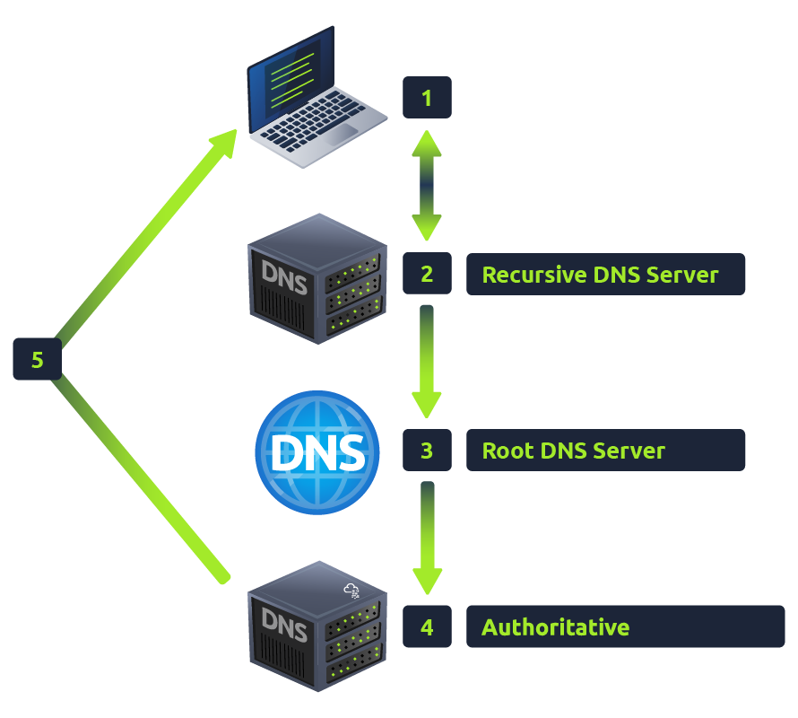

# DNS in Detail
> link: https://tryhackme.com/room/dnsindetail
## DNS(Domain Name System)란?  
복잡한 숫자 없이 인터넷 기기와 통신할 수 있는 간단한 방법  
**IP 주소**(ex> 10.26.10.249와 같은 0~255의 4자리 숫자가 마침표로 구분된 형태)  
=> **DNS**를 사용해 편하게 작성 가능 (ex> rinseo.github.io)

## DNS Hierarchy

- **TLD (Top-Level Domain - 최상위 도메인)**  
    Domain의 가장 오른쪽 부분(ex> .com)  
    - gTLD(General - 일반)  
        ex> .com(상업적), .org(조직), .edu(교육), etc..   
        => 점점 증가하는 추세
    - ccTLD(Country Code - 국가 코드)  
        ex> .co.uk(영국), co.kr(한국), etc..
- **Second-Level Domain - 2차 도메인**  
    rinseo.github.io라고 할 때, ```rinseo```는 SLD, ```.github.io```는 TLD 중 ```.io```의 ccTLD를 포함한 eTLD를 뜻함   
    <details>  
    <summary>eTLD?</summary>

    eTLD(effective Top-Level Domain - 유효 최상위 도메인): 별개의 조직이 도메인을 등록할 수 있는 도메인 접미사(suffix)  
    ```.github.io```에서 ```.io```만은 ccTLD지만, ```.github.io``` 이렇게 합쳐지면, 접미사가 붙은 **eTLD**가 된다.
    </details>   
- **Subdomain - 하위 도메인**   
    2차 도메인의 왼쪽에 위치함.  
    ex> admin.rinseo.io일 때, ```admin``` 부분이 하위 도메인   
    2차 도메인과 동일 생성 제한을 가짐(최대 63자, az,0-9,-만 사용 가능, 길이는 253자 이하로 유지)

## DNS Record Types
- **A Record**: IPv4 주소 매핑 (ex> 10.54.29.1)
- **AAAA Record**: IPv6 주소 매핑 (ex> 2001:0b8d:90a2:0000:0000:8e01:1942)
- **CNAME(Canonical NAME) Record**: 도메인의 다른 이름
    - 최상위에서는 사용할 수 없음
- **MX(Mail eXchanger) Record**: 메일 서버 주소
    - 우선순위 플래그 존재
    - 클라이언트에게 어떤 순서로 서버를 지나야 하는지 알려줌
- **TXT Record**: 텍스트 데이터 제공
    - 도메인을 대신해 이메일을 발송할 권리가 있는 서버 나열, 타사 서비스 가입 시 도메인 이름 소유권 확인

## Making A Request
### DNS 요청을 했을 때 발생하는 일!

1. 도메인 이름을 요청(도메인 클릭)하면, **로컬 캐시**에서 최근에 조회한 일이 있는지 확인한다. 만약 없으면 Recursive DNS 서버에 요청한다 -> *<u>내 컴퓨터가 이 주소를 알고 있는지 체크! 모르면 DNS server한테 물어보기*</u>
2. **Recursive DNS Server**: 주로 ISP(Internet Service Provider ex> KT, SKT, U+)에서 제공한다. (직접 선택 가능) -> *<u>만약 ISP 내에서 주소를 가지고 있다면 바로 접속, 아니면 최상위 DNS server로 이동!*</u>
    1. 로컬 캐시 확인 (ex> Google, Facebook ...)
    2. 인터넷의 Root DNS 서버부터 시작해서 찾기 시작
3. **Root DNS Server**: 요청에 따라 바로 최상위 도메인에 바로 리다이렉션을 하는 역할을 한다. -> *<u>TLD로 안내함</u>*  
    ex> ```www.tryhackme.com``` 요청 -> Root 서버는 ```.com```의 최상위 도메인 인식 후 올바른 TLD 서버로 안내
4. **TLD SErver**: DNS 요청에 **응답할 권한이 있는 서버**(도메인의 네임서버)를 찾을 수 있는 레코드를 보관한다. -> *<u>TLD를 관리하는 서버! 해당 사이트의 진짜 정보가 어디서 관리하고 있는지 확인 가능함*</u>  
    네임서버가 여러 개 있는 이유는 백업 역할을 함
5. **Authoritative DNS Server**: 도메인 이름에 대한 DNS 레코드 저장하고 도메인 이름 DNS 레코드에 대한 모든 업데이트가 이뤄지는 서버다. -> *<u>진짜 원본 DNS 정보 갖고 있음*</u>
6. **Caching**, **TTL** : Recursive DNS Server에서 받은 정보를 캐시에 저장한다. 이 때 저장되는 시간은 TTL(Time To Live) 값으로 정해져 있다. -> *<u>접속 정보를 캐시에 저장(캐싱)하고 다음에 접속할 때 빨리 접속 가능!</u>*