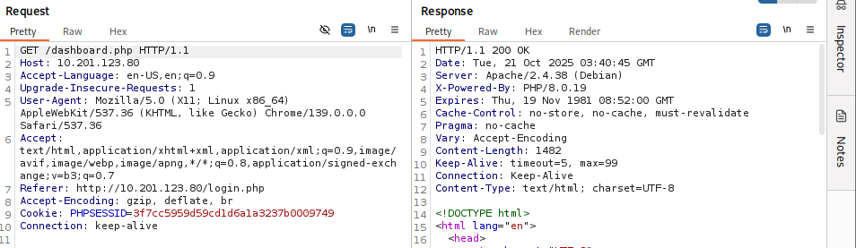
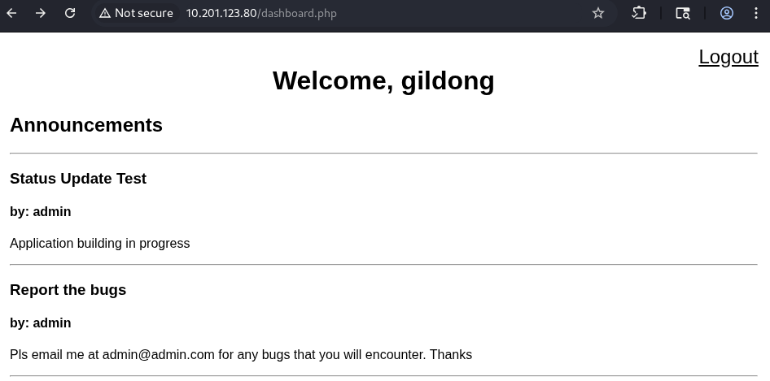
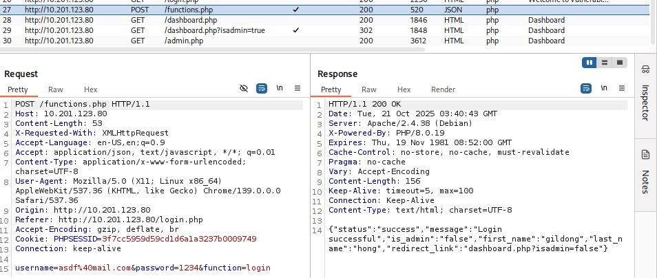
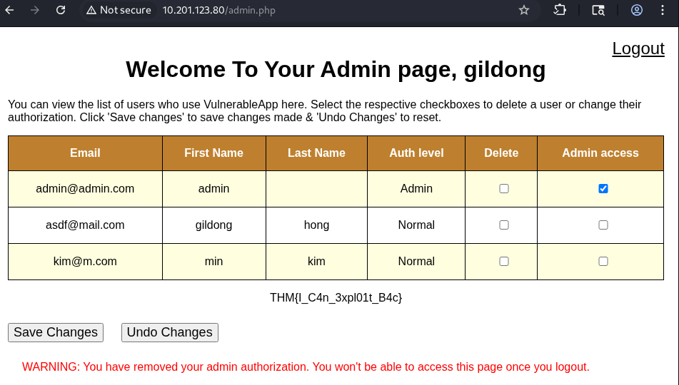

# 1. Broken Access Control (손상된 액세스 제어)
## 정의
웹 애플리케이션이 사용자 접근 권한을 제대로 관리하지 못하는 경우 발생하는 웹 취약점 
## IDOR (Insecure Direct Obejct Reference)
일반적으로 볼 수 없는 리소스에 접근할 수 있는 액세스 제어 취약점. 프로그래머가 직접 객체 참조를 노출할 때 발생함.
### HTB answer (IDOR)
> 1. http://10.201.57.21 접근 후, noot/test1234로 로그인
> 2. 메모 확인
> 3. 메모 내 힌트 존재함
> 4. http://10.201.57.21/note.php?note_id=0 접근하여 플래그 확인

## OWASP Broken Access Control
> 링크: https://tryhackme.com/room/owaspbrokenaccesscontrol

### 웹 애플리케이션 평가

로그인 후 http://10.201.123.80/ 링크 내 대시보드를 BurpSuite를 사용해 트래픽을 확인했다. 이 패킷과 웹사이트를 통해 질문에 대한 답을 할 수 있다.

> <details>
> <summary>1. 웹 애플리케이션을 호스팅하는 서버 유형은 무엇인가요? Burp Suite의 요청 응답에서 확인할 수 있습니다.</summary>
> 
> **apache** 서버 사용 중임 (OS는 Debian)
> 
> response 패킷을 통해 알 수 있다.
> </details>
>
> <details>
> <summary>2. 로그인 요청의 JSON 응답에서 리디렉션 링크가 포함된 매개변수의 이름은 무엇입니까?</summary>
> 
> **redirect_link**  
> 
> 로그인 요청 패킷에서 ```/functions.php```의 JSON을 확인하여 알 수 있다.
>
> ### JSON 내용 확인
> ```json
> {"status":"success","message":"Login successful","is_admin":"false","first_name":"gildong","last_name":"hong","redirect_link":"dashboard.php?isadmin=false"}
> ```
> </details>
>
> <details>
> <summary>3. Burp Suite 모듈은 우리  와 타겟 간의 요청과 응답을 캡처하는 데 어떤 기능을 제공합니까?</summary>
> 
> **proxy**  
> 
> 웹 프록시 서버로, 브라우저와 대상 웹 서버 사이의 중간자 역할을 하여 양방향으로 전달되는 트래픽을 가로채서 검사 및 수정 가능함
> </details>
>
> <details>
> <summary>4. 온라인 사용자 표에서 찾을 수 있는 관리자의 이메일은 무엇입니까?</summary>
> 
> **admin@admin.com** (웹 사이트 내 확인 가능함)
> </details>

---

### 웹 애플리케이션 활용

로그인 후 접근하는 대시보드는 ```/dashboard.php```로, 파라미터가 보이지 않는다.
 
로그인할 때, 중간에 ```/functions.php```의 JSON을 통해 admin 페이지로 넘어갈 지 결정하는 파라미터가 존재함을 확인했다. (```redirect_link```의 ```isadmin``` 파라미터)


원래 ```/dashboard.php```로 넘어가야 하지만, ```isadmin=true```의 파라미터를 넣어 admin 페이지에 접근할 수 있었다. (vertical privilege escalation, 수직적 권한 상승)

> <details>
> <summary>1. admin.php에 접근한 후 어떤 종류의 권한 상승이 발생했습니까?
> </summary>
> 
> **vertical privilege escalation**
> </details>
> 
> 
> <details>
> <summary>2. 공격자가 관리자 페이지에 접근할 수 있도록 하는 매개변수는 무엇입니까?</summary>
> 
> **isadmin**
> </details>
> 
> <details>
> <summary>3. 관리자 페이지의 플래그는 무엇입니까?</summary>
> 
> **THM{I_C4n_3xpl01t_B4c}**
> </details>   

---   
   
### 완화: PHP 애플리케이션의 액세스 제어 취약점 위험을 최소화할 수 있는 방법
1. 역할 기반 접근 제어(RBAC) 구현: 역할 정의 후, 접근 권한 할당하여 사용자가 시스템에서 수행할 수 있는 작업 제어 가능
2. 매개변수화된 쿼리 사용: 악의적인 사용자가 DB에 무단으로 접근할 수 있는 위험을 줄일 수 있음 (SQL Injection 예방 - SQL 구문과 데이터 분리, Prepared Statement 사용)
3. 적절한 세션 관리: 보안 쿠키 사용/세션 시간 초과 설정/사용자가 가질 수 있는 활성 세션 수 제한 등 적용
4. 안전한 코딩 관행 사용: 보안 취약점 유입 방지 방법 (사용자 입력 정제/검증, 안전하지 않은 함수/라이브러리 피하기)
